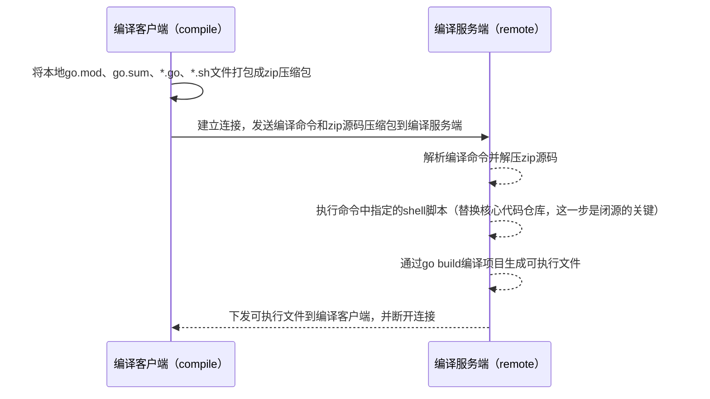

# closed-source-solution

### 1.介绍

closed-source-solution是一款用于Go商业项目闭源化的解决方案。该解决方案分为编译客户端（compile）和编译服务端（remote）两部分组成，主要工作流程如下：



### 2.优势

* 支持商业项目闭源化解决方案。

* 支持自定义shell执行脚本，可根据自身需求做定制化的核心库替换工作。

* 支持编译客户端侧的自动环境检测（GOOS、GOARCH等），根据环境自动选择合适的编译参数。

* 支持文件分块传输，传输效率非常高。

* 支持服务端编译错误的返回，客户端可根据错误信息进行调试。


### 3.安装

> 使用go install进行安装需要首先安装go 1.25+环境

```bash
go env -w GOSUMDB=off

# 安装编译客户端
go install github.com/dobyte/closed-source-solution/compile@latest -o closed-source-solution-compile

# 安装编译服务端
go install github.com/dobyte/closed-source-solution/remote@latest -o closed-source-solution-remote

go env -w GOSUMDB=on
```

### 4.remote用法

```bash
NAME:
   closed-source-solution-remote - remote compile server

USAGE:
   closed-source-solution-remote [global options]

GLOBAL OPTIONS:
   --addr string  specify the address of the server (default: ":8080")
   --help, -h     show help
```

### 5.compile用法

```bash
NAME:
   closed-source-solution-compile - local compile client

USAGE:
   closed-source-solution-compile [global options]

GLOBAL OPTIONS:
   --cgo                       specify whether to enable CGO; it is disabled by default.
   --goos string               specify the target operating system; default is current operating system. (default: "windows")
   --goarch string             specify the target architecture; default is current architecture. (default: "amd64")
   --output string, -o string  specify the output file name; default is main.exe on Windows, main on other platforms.
   --packages string           specify the path to the package to compile; default is current directory. (default: ".")
   --shell string              specify the shell to execute before compiling; default is empty.
   --remote string             specify the remote server address
   --help, -h                  show help
```